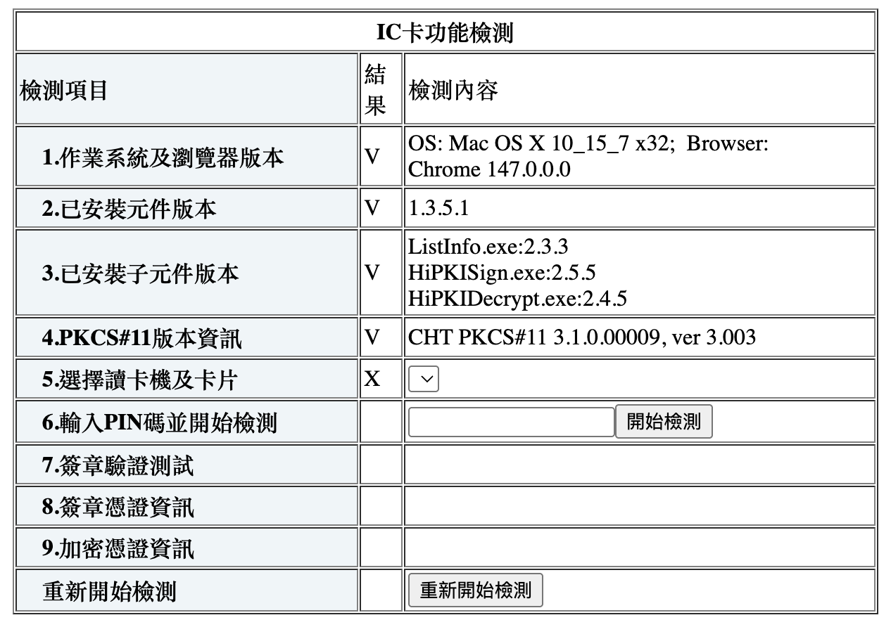
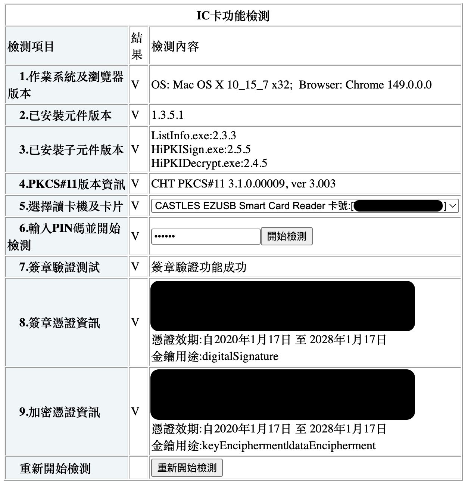

[繁體中文](README.md) | **English**

# EZ100PU on Apple Silicon macOS

Make a **Castles EZ100PU** smart-card reader work on an Apple Silicon Mac (M1/M2/M3/M4) — including with Taiwan e-government services (報稅 / 健保 / 自然人憑證) that talk to the reader through the HiPKI local server.

> **TL;DR** — the vendor never shipped an arm64 driver. This repo gives you a tiny (~330 KB), self-contained, open-source one plus a one-command installer.
>
> ```sh
> git clone https://github.com/andrew54068/ez100pu-apple-silicon.git
> cd ez100pu-apple-silicon
> sudo ./scripts/install.sh
> # follow the final on-screen instructions (usually: unplug/replug the reader —
> # occasionally: reboot, if the smart-card daemon was already running)
> ./scripts/verify.sh
> ```

---

## Who this is for

You have an EZ100PU (the grey/black USB reader ubiquitous in Taiwan for 自然人憑證 and 健保卡) and a Mac with Apple Silicon, and:

- macOS doesn't list the reader, **or**
- the HiPKI 自我檢測 page (`http://localhost:61161/selfTest.htm`) shows **X** at step 5 「選擇讀卡機及卡片」 with an empty reader dropdown.

Works on macOS 11+ (built and verified on macOS 15.7.1, Apple M3).

---

## Why the reader doesn't work out of the box

Three independent things are in the way. The installer handles all three; this is what's actually going on.

1. **No native driver.** The EZ100PU is *not* a standard CCID reader — it has protocol quirks (big-endian length field, no CCID class descriptor, an `0x00`-prefixed ATR). Apple's built-in CCID driver ignores it. The vendor's only macOS driver (`ezusb.bundle`) is **x86_64-only** and cannot load on Apple Silicon.

2. **The open-source driver needs three fixes to load.** We use [`ezIFD`](https://github.com/drinkcat/ezIFD) (a CCID fork that adds EZ100PU support). Built as-is on a current toolchain it still won't load, because:
   - its generated `Info.plist` contains an **unescaped `<email>`** → invalid XML → macOS shows the driver as `(null):(null)`;
   - its `CFBundleIdentifier` **collides** with Apple's system CCID driver → the daemon de-dupes and ignores ours;
   - an unsigned/quarantined bundle is refused → it must be **ad-hoc signed**.

3. **The vendor driver shadows ours — and comes back.** The x86_64 `ezusb.bundle` matches the same USB VID/PID (`0x0CA6/0x0010`). When present it wins the match, fails to load on arm64, throws a `BTMErrorDomain Code=-98`, and the reader vanishes from PCSC **entirely**. Some HiCOS installers/updates re-drop it (pkg id `com.mygreatcompany.pkg.EZ100driver`). If your reader dies right after a HiCOS update — that's this. Just re-run `install.sh`.

### How macOS finds a third-party reader driver

`com.apple.ifdreader` scans two directories:

| Path | Writable? | Use |
|------|-----------|-----|
| `/usr/libexec/SmartCardServices/drivers/` | No (SIP) | Apple's built-in CCID driver |
| `/usr/local/libexec/SmartCardServices/drivers/` | **Yes** | Third-party drivers — we install here |

So no SIP disabling is needed. We drop a properly-signed arm64 bundle in the writable path, remove the conflicting vendor bundle, and re-trigger enumeration with a physical replug.

---

## Install (recommended: prebuilt)

The prebuilt bundle in [`prebuilt/ifd-ez.bundle`](prebuilt/) is arm64, **statically links libusb** (zero Homebrew/runtime dependencies), and is ad-hoc signed. No build tools required.

```sh
sudo ./scripts/install.sh
```

The installer tells you what to do next, because it depends on whether the smart-card daemon (`com.apple.ifdreader`) was already running when you installed:

- **Wasn't running yet** (typical first-time install) — just **unplug the EZ100PU, wait 3 seconds, and plug it back in** (this fires the USB event that makes macOS re-scan).
- **Was already running** (e.g. you'd already opened a HiPKI/e-gov page, or this is a reinstall) — macOS's System Integrity Protection refuses to force-restart it in place, even as root, so **reboot** instead. A fresh daemon picks up the new driver at boot.

Either way, finish with:

```sh
./scripts/verify.sh
```

Expected:

```
==> 3. Reader visible to macOS?
 ✓ #01: CASTLES EZUSB Smart Card Reader (ATR:{...})
==> 4. Enumerable through PCSC API?
 ✓ SCardListReaders -> ['CASTLES EZUSB Smart Card Reader']
All checks passed — the EZ100PU is working.
```

If step 3 passes but step 4 doesn't, that's the SIP/stale-daemon case above — reboot and re-run `verify.sh`.

### Using it with Taiwan e-gov services (HiPKI)

> **Prerequisite: install the government's web component first.** This repo only makes the reader visible to macOS; the thing the e-gov websites actually talk to is the **自然人憑證跨平台網頁元件** (Citizen Digital Certificate cross-platform web component, a.k.a. HiPKI Local Server) — it runs the `localhost:61161` service and bundles the HiCOS card driver. Download and install it from MOICA (內政部憑證管理中心): <https://moica.nat.gov.tw/rac_plugin.html>. It and this driver are independent — you need both.

The HiPKI local server enumerates readers **once at startup**, so after installing the driver it needs a nudge:

```sh
launchctl kickstart -k gui/$(id -u)/com.node.HIPKILocalServer.cht
```

Reload `http://localhost:61161/selfTest.htm` — step 5 should now show your reader and card number, and steps 6–9 (PIN / 簽章驗證 / 憑證資訊) should all pass.

**Before vs. after** on the HiPKI self-test page:

| Before | After |
|---|---|
|  |  |

---

## Build from source (trust path)

If you'd rather not trust a prebuilt binary, or you're on a different macOS/arch, build it yourself. This reproduces the exact known-good bundle, including the autotools workarounds not in upstream's README.

```sh
./scripts/build-from-source.sh            # builds into ./build
./scripts/build-from-source.sh --install  # builds, then installs
```

Dependencies (Homebrew): `autoconf automake libtool libusb pkg-config flex autoconf-archive`. The script offers to install any that are missing. See [`docs/HOWTO.md`](docs/HOWTO.md) for a full annotated walk-through of every step and why it's needed.

---

## Uninstall

```sh
sudo ./scripts/uninstall.sh
```

---

## Repository layout

```
prebuilt/ifd-ez.bundle      Prebuilt arm64 driver (ad-hoc signed, static libusb)
scripts/install.sh          One-command installer (uses prebuilt bundle)
scripts/uninstall.sh        Remove the driver
scripts/verify.sh           End-to-end proof: PCSC enumeration (no sudo)
scripts/build-from-source.sh  Reproducible build with all fixes applied
docs/HOWTO.md               Annotated deep-dive / troubleshooting
```

---

## Troubleshooting

| Symptom | Cause | Fix |
|---------|-------|-----|
| Driver listed as `(null):(null)` in `system_profiler SPSmartCardsDataType` | Invalid `Info.plist` XML | Reinstall — the installer ships a valid, signed plist |
| Reader was working, died after a HiCOS update | `ezusb.bundle` got re-dropped and shadows our driver | Re-run `sudo ./scripts/install.sh` |
| Reader in `system_profiler` but **not** in HiPKI dropdown | HiPKI server has a stale slot list | `launchctl kickstart -k gui/$(id -u)/com.node.HIPKILocalServer.cht` and reload the page |
| Nothing under `Readers:` after install | USB match event not fired | Physically unplug/replug the reader |
| Reader shows in `verify.sh` step 3 (`system_profiler`) but step 4 (PCSC/`SCardListReaders`) still fails, even after replugging | `com.apple.ifdreader` was already running before install — it's SIP-protected, so macOS won't let it (or you, or root) force-reload the drivers directory in place | **Reboot**, then re-run `./scripts/verify.sh` — `install.sh` detects this case and tells you upfront |
| `install.sh` refuses on Intel | Prebuilt is arm64-only | Use `./scripts/build-from-source.sh` |

Deeper diagnostics — watch the daemon evaluate the reader live:

```sh
log stream --predicate 'processImagePath CONTAINS "ifdreader" OR composedMessage CONTAINS "0CA6"' --style compact
# then replug the reader
```

---

## Credits & license

- Driver: [`ezIFD`](https://github.com/drinkcat/ezIFD) by drinkcat — a fork of [CCID](https://github.com/LudovicRousseau/CCID) by Ludovic Rousseau. Licensed **LGPL-2.1**; the bundle in `prebuilt/` is a build of that source (pinned commit + full license text in [`NOTICE.md`](NOTICE.md) and [`licenses/LGPL-2.1.txt`](licenses/LGPL-2.1.txt)) and carries the same license.
- This packaging (scripts, docs, installer) — MIT. See [`LICENSE`](LICENSE).

Provenance, exact upstream commits, the modifications made, and how to rebuild the corresponding source are in [`NOTICE.md`](NOTICE.md). Verify the prebuilt binary's integrity with `cd prebuilt && shasum -a 256 -c SHA256SUMS`.

## Disclaimer

Provided **AS IS, without warranty of any kind, and used at your own risk.** This installs a third-party driver into a system security path and is used with digital-certificate hardware (e.g. Taiwan 自然人憑證) that can carry legal weight. The authors are not liable for any damage, data loss, or failed/invalid digital signatures arising from its use. If a legally-reliable signature matters, verify results through official channels. Not legal advice. See [`NOTICE.md`](NOTICE.md) §5.

This project is **not affiliated with, authorized by, or endorsed by** Castles Technology, Chunghwa Telecom (中華電信 / HiCOS / HiPKI), or Apple. Product names are used only to state compatibility.
